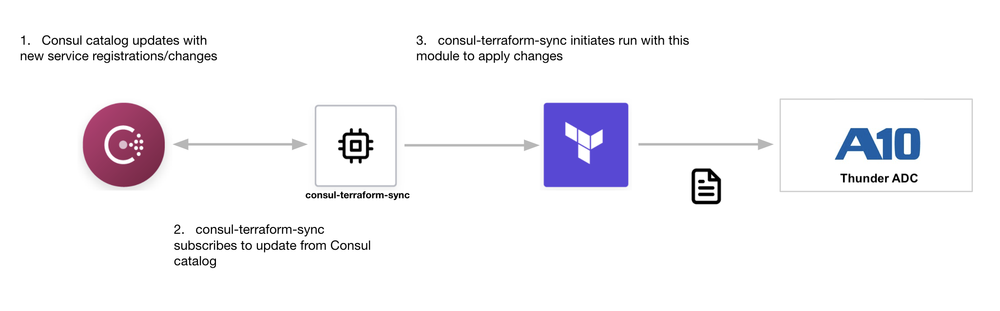

# A10 Networks Thunder ADC Service Group Module or Network Infrastructure Automation (NIA)
This Terraform module allows users to support **Dynamic L7 Load Balancing** by integrating [Consul](https://www.consul.io/) with A10 Networks [Thunder ADC](https://www.a10networks.com/products/thunder-adc/) to dynamically manage dynamic registration/de-registration of **Service Group** members based on services defined in the Consul catalog.  

Using this Terraform module in conjunction with **consul-terraform-sync** enables teams to reduce manual ticketing processes and automate Day-2 operations related to application scale up/down in a way that is both declarative and repeatable across the organization and across multiple **ACOS** devices.

#### Note: This Terraform module is designed to be used only with **consul-terraform-sync**


## Feature
This module supports the following:
* Create, update and delete Service Group members based on service attributes for that service in Consul catalog. If the service address is not defined in Consul catalog, the node address is used instead.

If there is a missing feature or a bug - - [open an issue (to be updated) ](https://github.com/dcallao/terraform-thunder-consul-sync-nia/issues/new)

## What is consul-terraform-sync?

The **consul-terraform-sync** runs as a daemon that enables a **publisher-subscriber** paradigm between **Consul** and **ACOS** based devices to support **Network Infrastructure Automation (NIA)**. 

<p align="left">
 </a>
</p>

* consul-terraform-sync **subscribes to updates from the Consul catalog** and executes one or more automation **"tasks"** with appropriate value of *service variables* based on those updates. **consul-terraform-sync** leverages [Terraform](https://www.terraform.io/) as the underlying automation tool and utilizes the Terraform provider ecosystem to drive relevant change to the network infrastructure. 

* Each task consists of a runbook automation written as a compatible **Terraform module** using resources and data sources for the underlying network infrastructure provider.

Please refer to this [link](https://www.consul.io/docs/nia/installation/install) for getting started with **consul-terraform-sync**

## Requirements

| Name | Version |
|------|---------|
| terraform | >= 0.13 |
| consul-terraform-sync | >= 0.1.0 |
| consul | >= 1.7 |

## Providers

| Name | Version |
|------|---------|
| a10networks/thunder | >= 0.4.7 |

## Compatibility
This module is meant for use with **consul-terraform-sync >= 0.1.0** and **Terraform >= 0.13** and **thunder provider versions >= 0.4.7**

## Permissions
* In order for the module to work as expected, the user associated with the **a10networks/thunder** Terraform provider must be a registered user on the Thunder ADC device.


## Usage
In order to use this module, you will need to install **consul-terraform-sync**, create a **"task"** with this Terraform module as a source within the task, and run **consul-terraform-sync**.

The users can subscribe to the services in the consul catalog and define the Terraform module which will be executed when there are any updates to the subscribed services using a **"task"**.

**~> Note:** It is recommended to have the [consul-terraform-sync config guide](https://www.consul.io/docs/nia/installation/configuration) for reference.
  
1. Download the **consul-terraform-sync** on a node which is highly available (prefrably, a node running a consul client)
2. Add **consul-terraform-sync** to the PATH on that node
3. Check the installation
    ```
    $ consul-terraform-sync --version
    0.1.0
    Compatible with Terraform ~>0.13.0
    ```
4. Create a config file **"tasks.hcl"** for consul-terraform-sync. Please note that this just an example. 
    ```
    log_level = <log_level> # eg. "info"

    driver "terraform" {
      log = true
      required_providers {
        thunder = {
          source = "a10networks/thunder"
          version = "0.4.7"
        }
      }
    }

    consul {
      address = "<consul agent address>" # eg. "1.1.1.1:8500"
    }

    provider "thunder" {
      address  = "<thunder_address"  # eg. "2.2.2.2"
      username = "<thunder_username>"
      password = "<thunder_password>"
    }

    task {
      name = <name of the task (has to be unique)> # eg. "Create_SG_on_ACOS"
      description = <description of the task> # eg. "Dynamic Address Groups based on service definition"
      source = "a10networks/thunder-nia/acos" # to be updated
      providers = ["thunder"]
      services = ["<list of services you want to subscribe to>"] # eg. ["web", "api"]
      variable_files = ["<list of files that have user variables for this module (please input full path)>"] # eg. ["/opt/acos-config/user-demo.tfvars"]
    }
    ```
5. Start consul-terraform-sync
    ```
    $ consul-terraform-sync -config-file=tasks.hcl
    ```
**consul-terraform-sync** will create right set of service groups on the ACOS device based on the values in consul catalog.

**consul-terraform-sync is now subscribed to the Consul catalog. Any updates to the serices identified in the task will result in updating the service groups in the ACOS device** 


**~> Note:** If you are interested in how **consul-terraform-sync** works, please refer to this [section](#how-does-consul-terraform-sync-work).


## How does consul-terraform-sync work?

There are 2 aspects of consul-terraform-sync.
1. **Updates from Consul catalog:**
In the backend, consul-terraform-sync creates a blocking API query session with the Consul agent indentified in the config to get updates from the Consul catalog.
consul-terraform-sync.
consul-terraform-sync will get an update for the services in the consul catalog when any of the following service attributes are created, updated or deleted. These updates include service creation and deletion as well.
   * service id
   * service name
   * service address
   * service port
   * service meta
   * service tags
   * service namespace
   * service health status
   * node id
   * node address
   * node datacenter
   * node tagged addresses
   * node meta

   
2. **Managing the entire Terraform workflow:**
If a task and is defined, one or more services are associated with the task, provider is declared in the task and a Terraform module is specified using the source field of the task, the following sequence of events will occur:
   1. consul-terraform-sync will install the required version of Terraform.
   2. consul-terraform-sync will install the required version of the Terraform provider defined in the config file and declared in the "task".
   3. A new direstory "nia-tasks" with a sub-directory corresponding to each "task" will be created. This is the reason for having strict guidelines around naming.
   4. Each sub-directory corresponds to a separate Terraform workspace. 
   5. Within each sub-directory corresponding a task, consul-terraform-sync will template a main.tf, variables.tf, terraform.tfvars and terraform.tfvars.tmpl.
      * **main.tf:**
         * This files contains declaration for the required terraform and provider versions based on the task definition. 
         * In addition, this file has the module (identified by the 'source' field in the task) declaration with the input variables
         * Consul K/V is used as the backend state for fo this Terraform workspace.
      
         example generated main.tf:
          ```terraform
         # This file is generated by Consul NIA.
         #
         # The HCL blocks, arguments, variables, and values are derived from the
         # operator configuration for Consul NIA. Any manual changes to this file
         # may not be preserved and could be clobbered by a subsequent update.

         terraform {
            required_providers {
              thunder = {
                source = "a10networks/thunder"
                version = "0.4.7"
              }
            }
            required_version = "~>0.13.0"
          }


          provider "thunder" {
            address  = var.thunder_host
            username = var.thunder_user
            password = var.thunder_passd
          }

          module "thunder_module" {
            source   = "../"
            services = var.services
            protocol = var.slb_service_group_protocol
          }

          ```
      * **variables.tf:**
        * This is variables.tf file defined in the module
        
         example generated variables.tf
         ```terraform
        variable "services" {
          description = "Consul services monitored by consul-terraform-sync"
          type = map(
            object({
              id                    = string
              name                  = string
              address               = string
              port                  = number
              status                = string
              meta                  = map(string)
              tags                  = list(string)
              namespace             = string
              node                  = string
              node_id               = string
              node_address          = string
              node_datacenter       = string
              node_tagged_addresses = map(string)
              node_meta             = map(string)
            })
          )
        }

        variable "slb_service_group_protocol" {
          description = "Protocol of the Consul services in service group"
          type    = string
          default = "udp"
        }

        variable thunder_host {}
        variable thunder_user {}
        variable thunder_passwd {}

         ```
      * **terraform.tfvars:**
         * This is the most important file generated by consul-terraform-sync.
         * This variables file is generated with the most updated values from Consul catalog for all the services identified in the task.
         * consul-terraform-sync updates this file with the latest values when the corresponding service gets updated in Consul catalog.
         
         example terraform.tfvars
         ```terraform
         slb_service_group_protocol = "tcp"
         services = {
           "api2" : {
             id              = "api2"
             name            = "api"
             address         = "172.31.29.206"
             port            = 8090
             meta            = {}
             tags            = ["api", "dc1", "test"]
             namespace       = null
             status          = "passing"
             node            = "i-03a2d3e5efc9df8fc"
             node_id         = "a179f33b-b4b5-bf85-1ba3-a8d29546dbfb"
             node_address    = "172.31.29.206"
             node_datacenter = "us-east-1"
             node_tagged_addresses = {
               lan      = "172.31.29.206"
               lan_ipv4 = "172.31.29.206"
               wan      = "172.31.29.206"
               wan_ipv4 = "172.31.29.206"
             }
             node_meta = {
               consul-network-segment = ""
             }
           },
           "api1" : {
             id              = "api1"
             name            = "api"
             address         = "172.31.13.27"
             port            = 8090
             meta            = {}
             tags            = ["api", "dc1", "test"]
             namespace       = null
             status          = "passing"
             node            = "i-06535c245da7eb639"
             node_id         = "3d32e036-8b5f-2528-6a08-153ee6246072"
             node_address    = "172.31.13.27"
             node_datacenter = "us-east-1"
             node_tagged_addresses = {
               lan      = "172.31.13.27"
               lan_ipv4 = "172.31.13.27"
               wan      = "172.31.13.27"
               wan_ipv4 = "172.31.13.27"
             }
             node_meta = {
               consul-network-segment = ""
             }
           },
           "api0" : {
             id              = "api0"
             name            = "api"
             address         = "172.31.94.1"
             port            = 8090
             meta            = {}
             tags            = ["api", "dc1", "test"]
             namespace       = null
             status          = "passing"
             node            = "i-0d61132ea5ad3c0bf"
             node_id         = "d7d41dc5-7b60-3dbb-0537-6abcf453daa9"
             node_address    = "172.31.94.1"
             node_datacenter = "us-east-1"
             node_tagged_addresses = {
               lan      = "172.31.94.1"
               lan_ipv4 = "172.31.94.1"
               wan      = "172.31.94.1"
               wan_ipv4 = "172.31.94.1"
             }
             node_meta = {
               consul-network-segment = ""
             }
           },
           "web0" : {
             id              = "web0"
             name            = "web"
             address         = "172.31.43.78"
             port            = 80
             meta            = {}
             tags            = ["dc1", "nginx", "test", "web"]
             namespace       = null
             status          = "passing"
             node            = "i-08040820d8d7c4984"
             node_id         = "63844302-407d-5cc6-a618-a9e5caad1d1f"
             node_address    = "172.31.43.78"
             node_datacenter = "us-east-1"
             node_tagged_addresses = {
               lan      = "172.31.43.78"
               lan_ipv4 = "172.31.43.78"
               wan      = "172.31.43.78"
               wan_ipv4 = "172.31.43.78"
             }
             node_meta = {
               consul-network-segment = ""
             }
           },
           "web3" : {
             id              = "web3"
             name            = "web"
             address         = "192.168.128.17"
             port            = 80
             meta            = {}
             tags            = ["dc1", "nginx", "test", "web"]
             namespace       = null
             status          = "passing"
             node            = "i-0d61132ea5ad3c0bf"
             node_id         = "d7d41dc5-7b60-3dbb-0537-6abcf453daa9"
             node_address    = "172.31.94.1"
             node_datacenter = "us-east-1"
             node_tagged_addresses = {
               lan      = "172.31.94.1"
               lan_ipv4 = "172.31.94.1"
               wan      = "172.31.94.1"
               wan_ipv4 = "172.31.94.1"
             }
             node_meta = {
               consul-network-segment = ""
             }
           },
           "web1" : {
             id              = "web1"
             name            = "web"
             address         = "172.31.51.85"
             port            = 80
             meta            = {}
             tags            = ["dc1", "nginx", "test", "web"]
             namespace       = null
             status          = "passing"
             node            = "i-0f92f7eb4b6fb460a"
             node_id         = "778506df-a1b2-65e0-fe1e-eafd2d1162a8"
             node_address    = "172.31.51.85"
             node_datacenter = "us-east-1"
             node_tagged_addresses = {
               lan      = "172.31.51.85"
               lan_ipv4 = "172.31.51.85"
               wan      = "172.31.51.85"
               wan_ipv4 = "172.31.51.85"
             }
             node_meta = {
               consul-network-segment = ""
             }
           }
         }
         
         ```
      * **Network Infrastructure Automation (NIA) compatible modules are built to utilize the above service variables**
    6. **consul-terraform-sync** manages the entire Terraform workflow of plan, apply and destroy for all the individual workspaces corrresponding to the defined     "tasks" based on the updates to the services to those tasks.
    
  **In summary, consul-terraform-sync triggers a Terraform workflow (plan, apply, destroy) based on updates it detects from Consul catalog.**